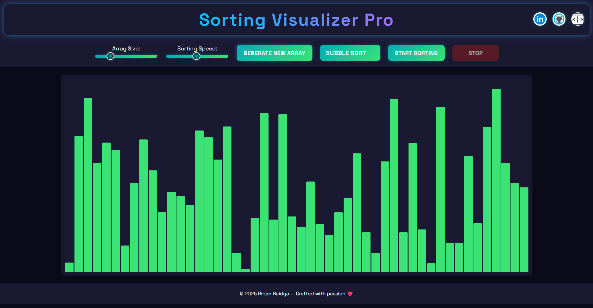

# 🔢 Sorting Visualizer Pro

**Sorting Visualizer Pro** is an interactive web application that visually demonstrates how different sorting algorithms work. Built with HTML, CSS, and JavaScript, it lets users intuitively control the array size, sorting speed, and choose between various algorithms—all brought to life through smooth, colorful animations.

 <!-- Replace with actual path if uploading image -->

## 🌟 Features

- 🎯 Real-time animation of sorting algorithms
- 🎛️ Adjustable array size and sorting speed
- 🔁 One-click array generation
- ✨ Clean, responsive UI with dark theme
- 🛑 Pause/Stop sorting mid-way
- 🔗 Quick access to LinkedIn and GitHub

## 🚀 Live Demo

Check out the live version here: [Sorting Visualizer Pro](https://sorting-visualizer-pro.vercel.app/) 


## 🛠️ Tech Stack

- **Frontend:** HTML, CSS, JavaScript
- **Design:** Custom dark mode UI with glowing elements

## 📂 Folder Structure

```bash
sorting-visualizer/
├── index.html
├── styles.css
├── script.js
├── images/
│   └── screenshot.png
